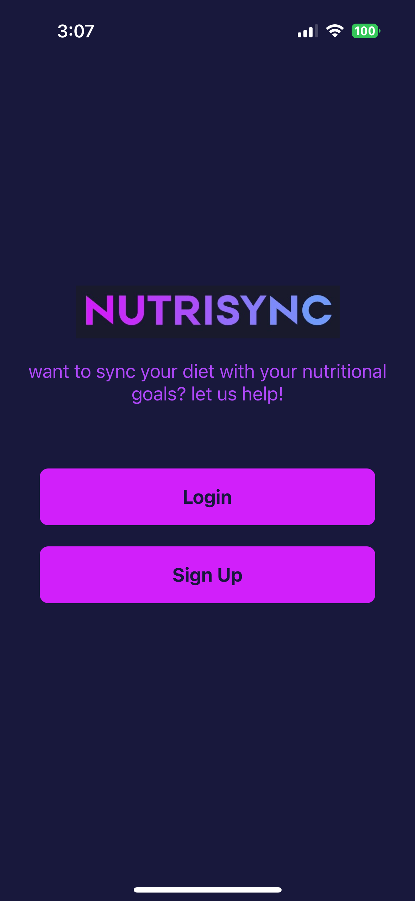
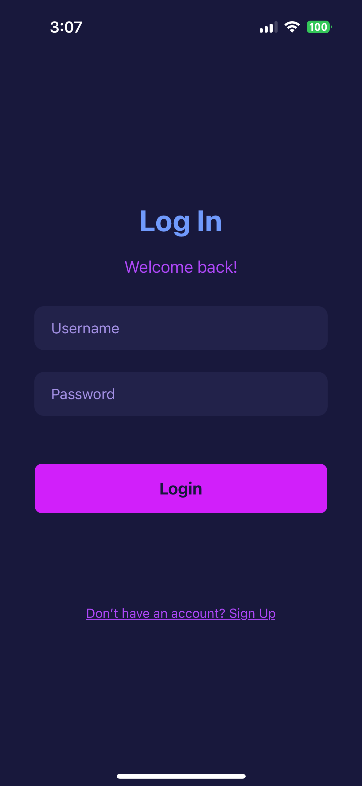
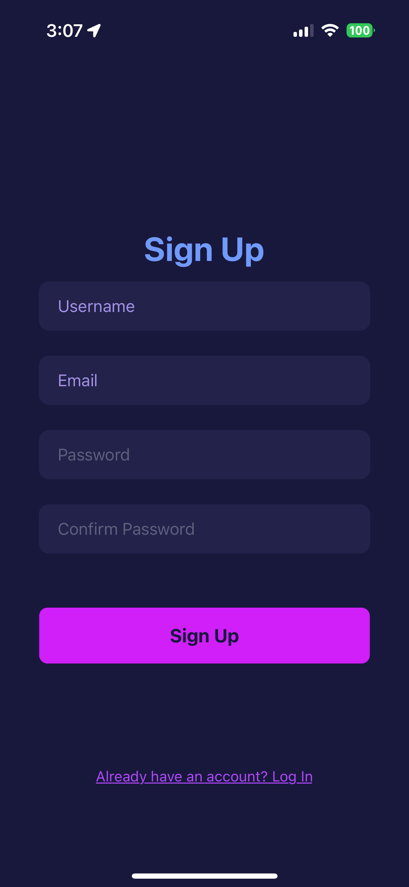
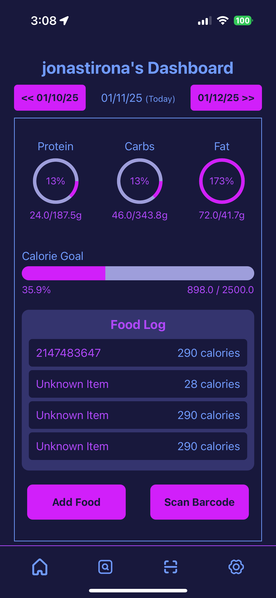
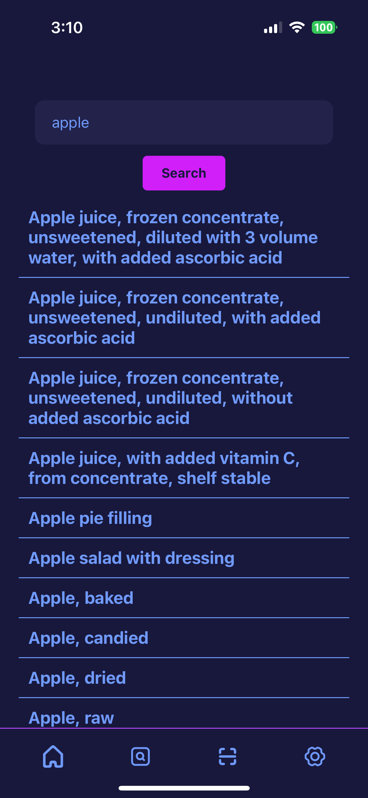
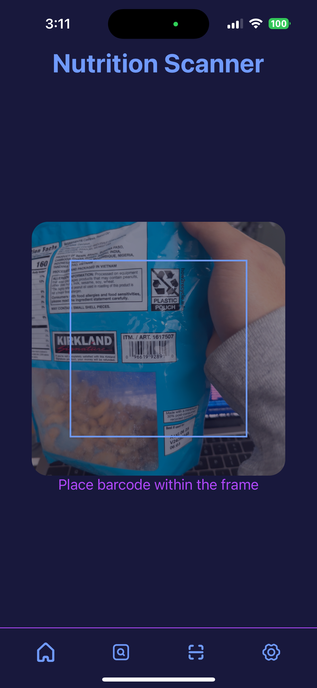
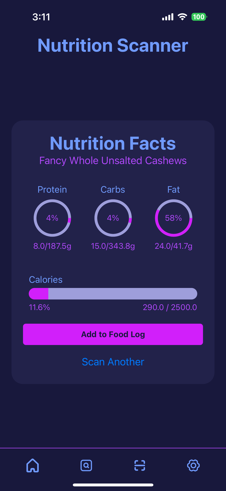
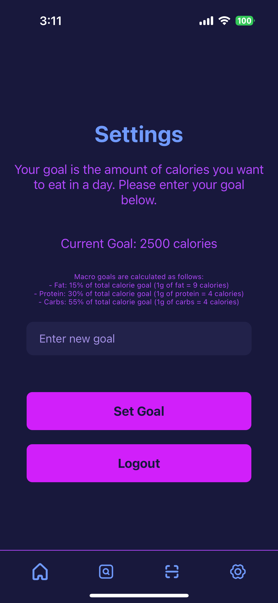

# Nutrisync Frontend 🥗

Nutrisync is an app dedicated to people trying to improve their fitness and diet habits. Nutrisync allows its users to track their diet throughout the day by letting users log food they ate while automatically keeping track of the calories and macronutrients accumulated. Users have multiple ways of logging their food including searching up food items, scanning food barcodes, or by manually typing in food macros.

This repository is dedicated to the frontend of the product, responsible for the user interface and interactions with the backend services.

## Developers
- Jonas Tirona
- Burhan Naveed

## Technologies Used 👨‍💻

### Client 📱
- JavaScript
- React Native
- Expo

### Server 🖥
- JavaScript
- Node.js
- Express.js
- AWS Elastic Beanstalk

### Database 📚
- MySQL
- AWS Relational Database Service

## Project Status 🏁

The frontend React Native app is complete, and the backend is fully developed with two minor bugs currently being addressed. 

Planned future enhancements include:

- **Caloric Intake Calculator**: Enable users to input their weight and goals to calculate recommended caloric intake and macros.
- **Recommended Foods Page**: Display suggested foods tailored to the remaining macros in the user's food log.
- **Custom Food Entry**: Allow users to add their own food items to the database.
- **Progress Visualization**: Introduce graphs or charts to track and display user progress over time.
- **Weight Tracking**: Provide functionality for users to log and monitor their weight.
- **Food Log Management**: Add options to update or delete entries from the food log.
- **NutriScanOCR API Integration**: Incorporate **NutriScanOCR**, a machine learning API that I am currently developing, to extract and log nutritional information directly from food labels.


## Project Structure 🏗

### Client-Side (Frontend) 📱
The frontend is built using React Native and Expo, providing a seamless and responsive user interface. Here are the key pages:

- **Index Page**: The landing page of the app, providing an overview and navigation to other sections.<br>
  
- **Login Page**: Allows users to log in to their accounts.<br>
  
- **Signup Page**: Enables new users to create an account.<br>
  
- **Home Page**: Displays an overview of the user's daily log and goals.<br>
  
- **Search Page**: Users can search for food items to log. This screen includes a search bar, search results, and detailed nutrient information for each food item.<br>
  
- **Scanner Page**: Allows users to scan barcodes to quickly log food items.<br>
  <br>
  
- **Settings Page**: Provides options for users to customize their app experience.<br>
  

### Server-Side (Backend) 🖥
The backend is implemented using Node.js and Express.js, hosted on AWS Elastic Beanstalk. It handles user authentication, food data retrieval, and logging functionalities. Key endpoints include:

- **/login**: Authenticates users.
- **/signup**: Registers new users.
- **/lookup**: Searches for food items based on keywords.
- **/barcode**: Retrieves food data based on barcode scans.
- **/getgoal**: Fetches the user's dietary goals.
- **/setgoal**: Sets the user's dietary goals.
- **/getlog**: Retrieves the user's daily log data.
- **/updatelog**: Updates the user's daily log data.

For more details, visit the [NutrisyncBackend GitHub repository](https://github.com/BurhanNaveed0/NutrisyncBackend).

### Database 📚
The database is managed using MySQL and hosted on AWS Relational Database Service. It stores user information, food data, and daily logs.

## Installation and Setup Instructions ⚙️

1. Clone the repository:
    ```sh
    git clone https://github.com/jonastirona/NutrisyncFrontend.git
    ```
2. Navigate to the project directory:
    ```sh
    cd nutrisyncFrontend
    ```
3. Install dependencies:
    ```sh
    npm install
    ```
4. Start the development server:
    ```sh
    npm start
    ```

## Usage 📲
- Open the Expo Go app on your mobile device.
- Scan the QR code generated by the development server to run the app on your device.
- Note: The Expo Go app cannot run the scanner page because it requires camera access. To use the scanner functionality, you will need to run the app natively on your device using `expo run:ios` or `expo run:android`.
